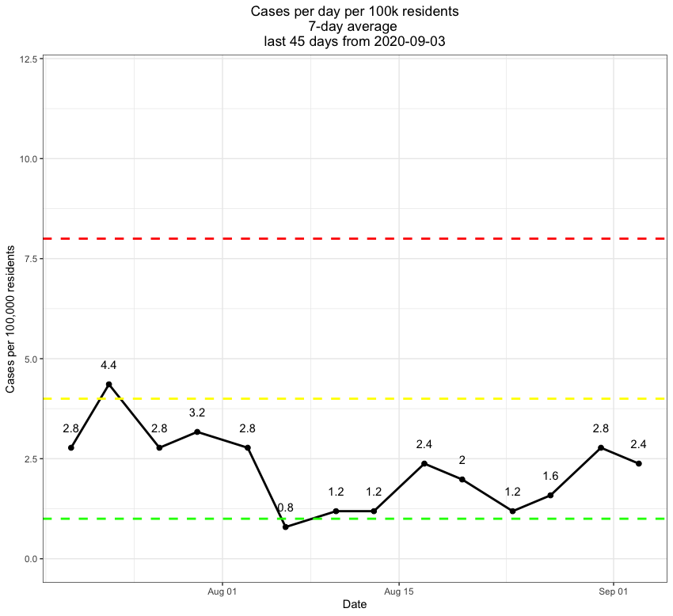

# NatickAreaCovid
Resources (plots, data, code) tracking infection rates in the Natick area.

This repository will be used to hold Covid data for the Natick area. Plots will be updated as data are published.  

Added the plot below tracking 7-day average of newly confirmed cases per 100k Natick population.

 
Natick twice-weekly data downloaded from https://www.natickma.gov/1702/Coronavirus-Updates-Community-Informatio 
  
Surrounding town data downloaded from MA covid dashboards, updated weekly on Wednesdays. See Data/PDFs/ folder above for historic data.
