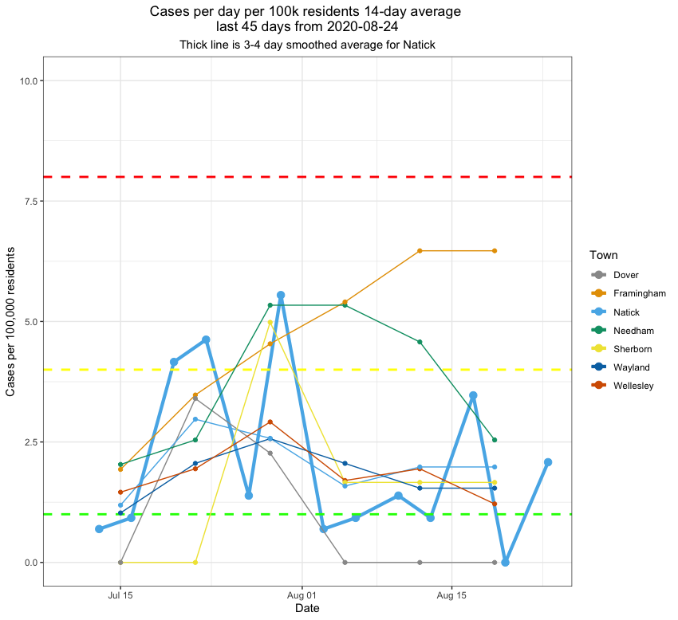

# NatickAreaCovid
Resources (plots, data, code) tracking infection rates in the Natick area.

This repository will be used to hold Covid data for the Natick area.  
Plots will be updated as data are published.  

