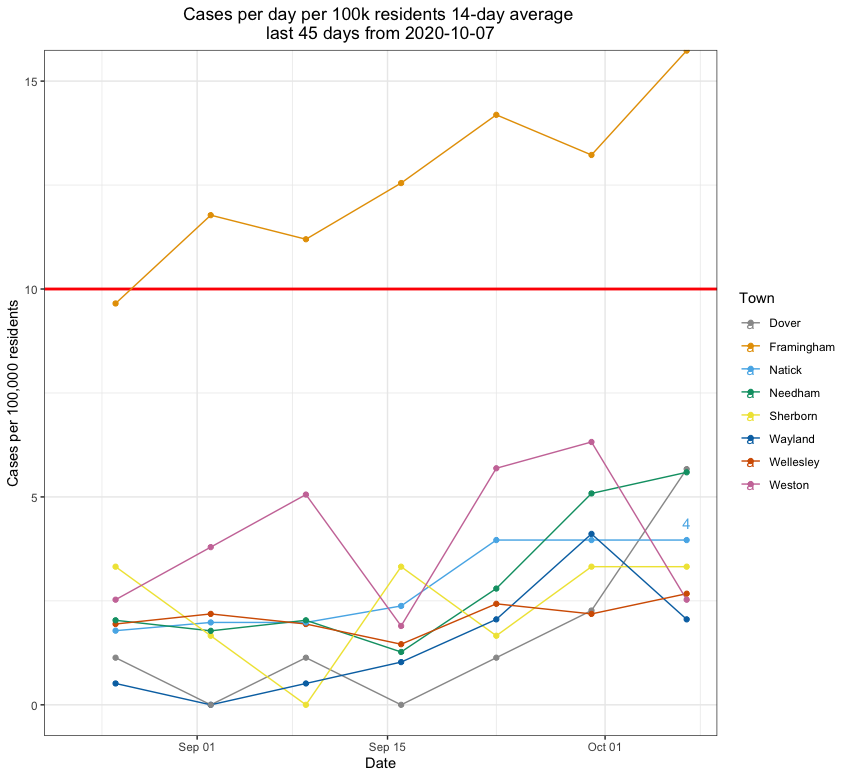
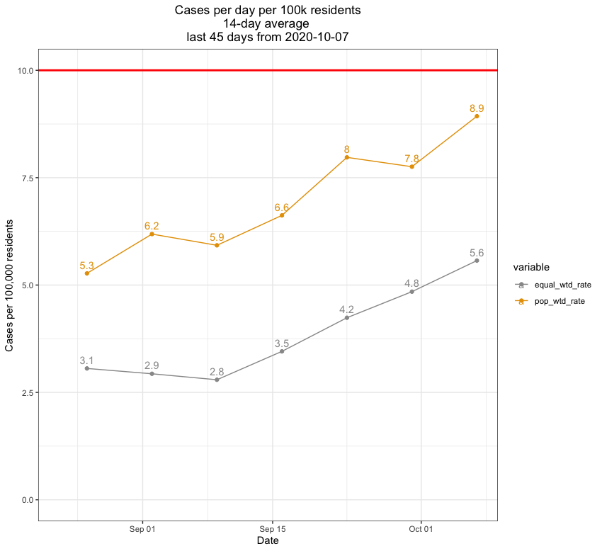
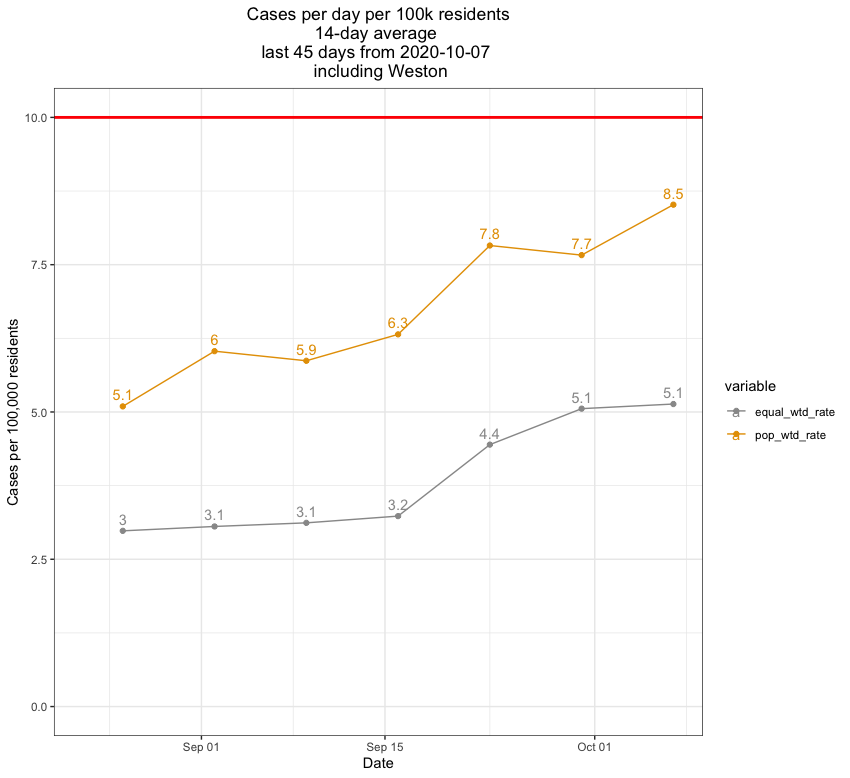
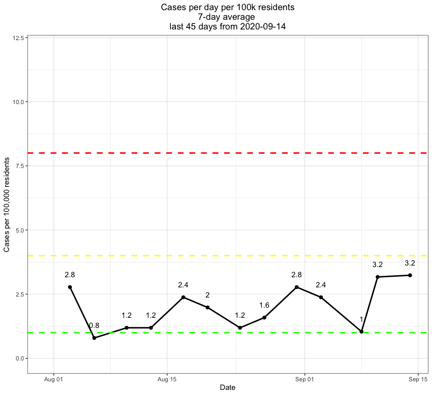

# NatickAreaCovid
Resources (plots, data, code) tracking infection rates in the Natick area.

This repository will be used to hold Covid data for the Natick area. Plots will be updated as data are published.  

The plot below tracks the 14-day average of newly confirmed cases per 100k population for Natick and bordering towns (Dover, Framingham, Sherborn, Wayland, and Wellesley).  
The "equal_wtd_rate" averages the towns' 14-day daily rates per 100k population equally.  
The "pop_wtd_rate" averages the towns' 14-day daily rates per 100k population based on town population.  

The plot below tracks the 14-day average of newly confirmed cases per 100k population for Natick and bordering towns (Dover, Framingham, Sherborn, Wayland, Wellesley, and Weston).  
The "equal_wtd_rate" averages the towns' 14-day daily rates per 100k population equally.  
The "pop_wtd_rate" averages the towns' 14-day daily rates per 100k population based on town population.  

Natick twice-weekly data no longer updated after 9/14/20.
Natick twice-weekly data downloaded from https://www.natickma.gov/1702/Coronavirus-Updates-Community-Informatio 
  
Surrounding town data downloaded from MA covid dashboards, updated weekly on Wednesdays. See Data/PDFs/ folder above for historic data.

The plot below tracked the 7-day average of newly confirmed cases per 100k Natick population. This is no longer updated as of 9/17/20 since Natick stopped updating data after 9/14/20. 

